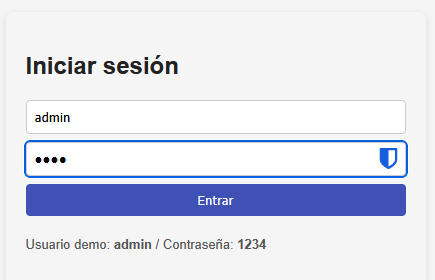
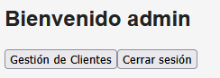
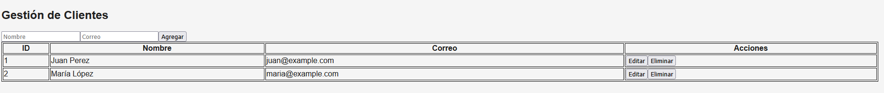

# spa-lab (Angular 17) - Plantilla para laboratorio

Este ZIP contiene **la carpeta `src/`** lista para copiar dentro de un proyecto Angular 17 generado con Angular CLI.
Por motivos de tamaño y compatibilidad, el ZIP **no** incluye `node_modules` ni archivos de configuración CLI completos.
Sigue los pasos abajo para crear el proyecto funcional y usar este código.

## Realizado por:
Vicente Granja, reutilizado por Freddy Alvarado

## Pasos rápidos (recomendado)

1. Asegúrate de tener Node.js y Angular CLI instalados.
2. Crear el proyecto base con Angular 17:
   ```bash
   ng new spa-lab --routing --style=css
   cd spa-lab
   ```
3. Añadir Angular Material:
   ```bash
   ng add @angular/material
   # seleccionar tema (por ejemplo: Indigo/Pink)
   ```
4. Reemplazar la carpeta `src/` creada por Angular CLI con la carpeta `src/` que contiene este ZIP.
   - En tu proyecto `spa-lab/`, elimina `src/` y copia la `src/` de este ZIP en su lugar.
5. Instalar dependencias y ejecutar:
   ```bash
   npm install
   ng serve --open
   ```
6. Usuario demo: `admin` / contraseña: `1234`

## Estructura incluida en este ZIP
- src/
  - app/
    - login/
    - dashboard/
    - clientes/
    - services/ (auth.service, cliente.service)
    - guards/ (auth.guard)
    - app-routing.module.ts
    - app.module.ts
  - environments/
  - index.html, main.ts, styles.css

## Notas
- Este proyecto usa **simulación** (localStorage + RxJS `of()` y `delay()`).
- Si deseas que te genere el proyecto completo (con `package.json`, `angular.json`) listo para `npm install` y `ng serve`, dímelo y lo preparo — pero el archivo será mayor.

## Capturas de pantalla
- Login

- Menu Principal

- Gestión de Clientes


